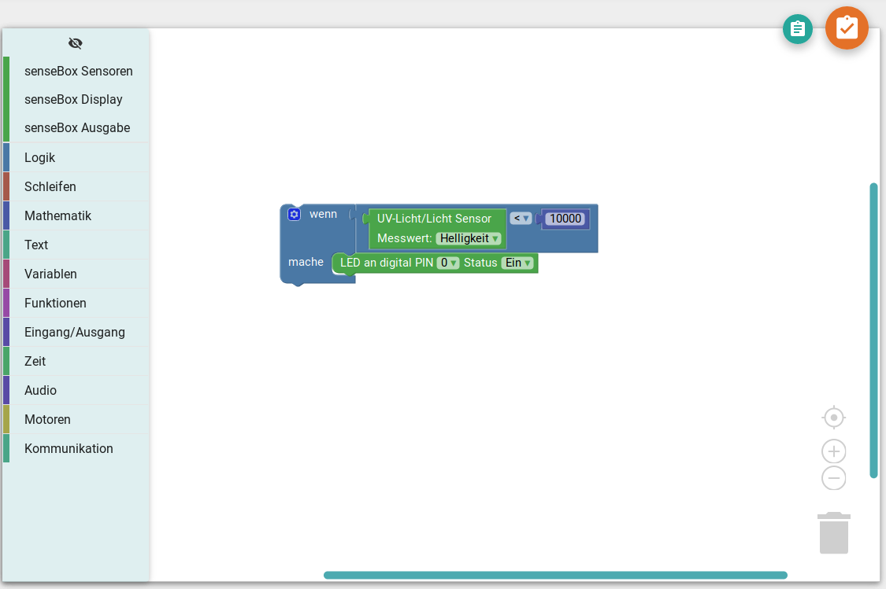

# Wetterstation Futurium 

# Table of Contents
1. [senseBox](#senseBox)
2. [Blockly für senseBox](#blockly)
3. [openSenseMap](#openSenseMap)
4. [Handreichung für Workshopleiter](#handreichung)
5. [Lehrmaterialien für SchülerInnen](#lehrmaterialien)

## senseBox
Mit der senseBox können SchülerInnen ihre eigene Wetterstation verkabeln und programmieren. Auf dem Bild ist das Herzstück der senseBox der Mikrocontroller(MCU) zu sehen.

An der MCU werden alle Sensoren angeschlossen die, die senseBox betreiben soll. Außerdem wird an der MCU die sogenannte "WiFi-Bee" angeschlossen (roter Chip unten links im Bild) um eine Verbindung mit dem Internet und somit der <a href="https://www.opensensemap.org">openSenseMap</a> herzustellen.

Im Laufe Unterrichtsstunde soll die senseBox Werte für :
- UV-Intensität
- Temperatur
- Luftdruck
- Beleuchtungsstärke
- Luftfeuchtigkeit
  
messen und auf die openSenseMap hochladen. Alle benötigten Sensoren sind in der senseBox:edu enthalten. 
Die 
## Blockly für senseBox
Blockly stellt die Programmieroberfläche für die senseBox dar. Es basiert auf einem einfachen Puzzle System in dem sich Schüler mit wenigen Mausklicks ein voll funktionierendes Programm zusammenstellen können.
Im Bild ist Beispielhaft ein Programmcode mit einer Wenn-Dann Abfrage aufgeführt. 

Ist der Wert für Beleuchtungsstärke unter 10.000 wird die LED-Lampe am Digitalen Port 0 eingeschaltet.

Haben die SchülerInnen ihren Programmcode fertiggstellt kann dieser auf die senseBox übertragen werden. Mit einem Klick auf 'Sketch kompilieren!' wird eine .bin Datei heruntergeladen. Diese .bin Datei muss auf die MCU, welche mit dem mitgelieferten USB-Kabel an den Computer angeschlossen wird, übertragen werden.

## openSenseMap
Die openSenseMap stellt eine Datenbank für Umweltmesswerte dar. Nachdem ein Account und eine Messstation auf der openSenseMap registriert wurde, können Messwerte von der senseBox auf die openSenseMap hochgeladen werden. Eine ausführliche Anleitung zur openSenseMap gibt es [hier](https://sensebox.github.io/books-v2/osem/).

## Handreichung für Workshopleiter
### Zeitplan 
Die Konfigurierung der Wetterstation bedarf erfahrungsgemäß 60 bis 90 Minuten und lässt sich grob wiefolgt aufteilen:
- Kennenlernen der senseBox und Blockly Programmieroberfläche (15-30 Minuten)
- Verkabelung, Programmierung und Testen der Sensoren (25 bis 40 Minuten)
- Registrierung auf der openSenseMap(5-10 Minuten)
- Hochladen auf der openSenseMap(10 Minuten)
### Mögliche Probleme und Lösungsvorschläge
<To be Inserted>
### Thematische Einordnung 
SchülerInnen bauen und Programmieren mit Hilfe der visuellen
Programmierumgebung Blockly eine Umweltmessstation mit den in der
senseBox:edu enthaltenen Sensoren (Temperatur, Luftfeuchtigkeit. Luftdruck,
Beleuchtungsstärke, UV(A)-Strahlung und verbinden Diese mit Hilfe eines
Hotspots mit dem Internet. Wenn möglich unternehmen Sie eine lokale
Messkampage und messen für eine kurze Zeit die Umweltphänomene, um Sie
anschließend auf der openSenseMap zu analysieren.

## Lehrmaterialien für SchülerInnen
Im folgenden wird beschrieben wie SchülerInnen alle Sensoren der senseBox:edu anschließen und programmieren können. Anschließend sollen die Messwerte auf die openSenseMap übertragen werden. Die Programmierung hierzu erfolgt über die Programmieroberfläche Blockly. 

